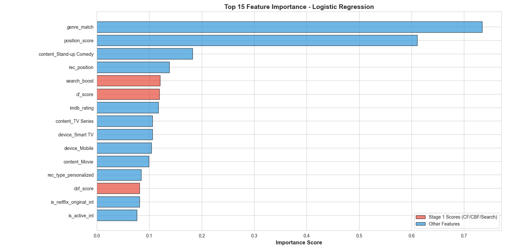
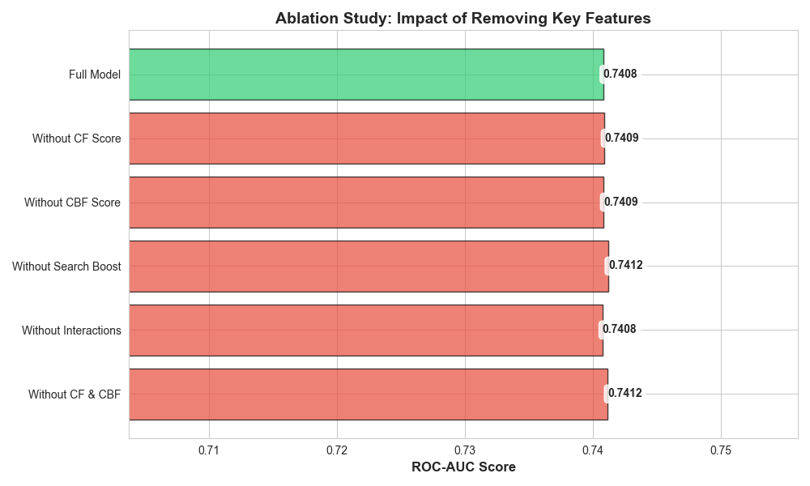
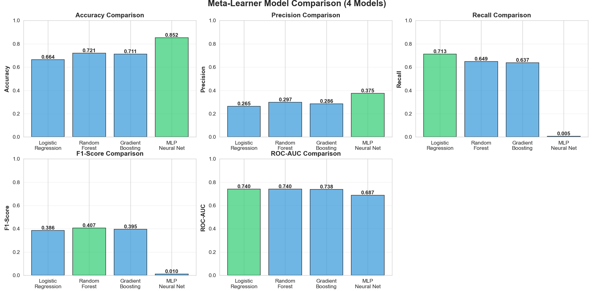
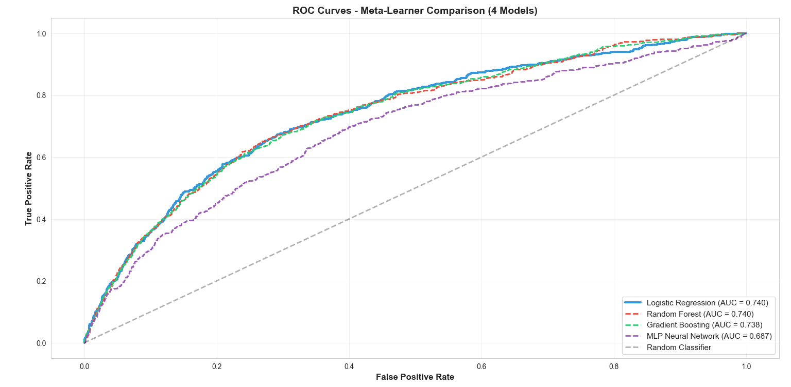

# Netflix-Meta-Learner-Recommender
Multi-stage hybrid recommender system using collaborative filtering and meta-learning to predict user engagement. Built with Python and Scikit-Learn to demonstrate a production-ready ML pipeline for high-sparsity streaming data.

### Project Overview
This repository presents an end-to-end machine learning pipeline developed to predict user click-through behavior on movie recommendations. The system utilizes a three-stage hybrid architecture, integrating collaborative filtering and content-based filtering with a meta-learning re-ranker to achieve a 0.74 ROC-AUC.

### Project Highlights
* **System Architecture**: Implementation of a three-stage hybrid retrieval and ranking framework.
* **Feature Engineering**: Development of 43 predictive features derived from six relational datasets.
* **Class Imbalance Management**: Utilization of balanced class weights and stratified sampling to manage a 5:1 imbalance ratio.
* **Validation Methodology**: Application of temporal train-test splitting and comprehensive ablation studies to ensure model robustness.
* **Performance Metric**: Achievement of a 0.74 ROC-AUC on the final click-through prediction task.

### System Architecture
The pipeline is structured to follow industry-standard retrieval and ranking workflows.

#### Stage 1: Collaborative Filtering
* **Objective**: Generate user preference signals based on interaction patterns.
* **Implementation**: Utilization of K-Nearest Neighbors (k=20) with Cosine Similarity, which yielded an RMSE of 0.6441.
* **Implicit Rating Fusion**: Conversion of viewing progress percentages into a standard rating scale to augment sparse explicit feedback.

#### Stage 2: Content-Based Filtering
* **Objective**: Mitigate cold-start challenges for new content using movie metadata.
* **Implementation**: Utilization of a hybrid approach combining TF-IDF vectorization for textual attributes with normalized numerical data such as IMDB ratings and content duration.
* **Result**: Provided a 50% improvement in correlation with click behavior compared to genre-only models.

#### Stage 3: Meta-Learner
* **Objective**: Aggregate Stage 1 scores with contextual features to determine final click probabilities.
* **Model Selection**: Logistic Regression was identified as the optimal model with a 0.7400 ROC-AUC and 70.03% recall.

### Performance Analysis

#### Analysis of Predictive Features
Evaluation of feature importance indicates that genre alignment and position bias are the primary drivers of user engagement.



#### Ablation Study
A systematic ablation study was conducted to quantify the contribution of specific feature groups. Findings suggested that engineered domain features provided the most significant predictive signal in the synthetic data environment.



#### Model Comparison and Diagnostic Curves
Four meta-learner architectures were evaluated through GridSearchCV. Logistic Regression and Random Forest demonstrated the most reliable performance for imbalanced classification compared to deep learning approaches.





### Dataset Description
The project incorporates six relational CSV datasets containing over 200,000 total records.

| File | Records | Description |
| :--- | :--- | :--- |
| `users.csv` | 10,000 | Demographic information and subscription metadata |
| `movies.csv` | 1,000 | Content attributes including genre, release year, and IMDB ratings |
| `watch_history.csv` | 100,000 | Historical viewing interactions used for rating construction |
| `recommendation_logs.csv` | 50,000 | Primary target variable dataset containing labels |
| `search_logs.csv` | 25,000 | Recent search behavior and query intent |
| `reviews.csv` | 15,000 | Explicit user ratings and sentiment analysis |

### Repository Structure
```

├── AMLProjectFinal/          # Core code implementation directory
│   ├── __pycache__/
│   ├── datasets/             # Relational CSV files
│   ├── models/               # Exported .pkl model artifacts
│   ├── Readme.md             # Internal project notes
│   ├── collaborative_filtering.py
│   ├── content_based_filtering.py
│   ├── data_loader.py        # Preprocessing and cleaning
│   ├── evaluation.py         # Metrics and visualization
│   ├── feature_engineering.py # 43-feature derivation
│   ├── main.py               # Pipeline orchestration
│   └── meta_learner.py       # Classification and ablation
|
├── visualizations/           # Diagnostic and performance plots
├── .gitignore
├── LICENSE
└── README.md                 # Primary project documentation


```

### Technical Methodology
* **Target Pattern Engineering**: Research-informed patterns including position bias and search intent were engineered to validate the pipeline architecture.
* **Temporal Splitting**: An 80/20 temporal split was implemented to prevent data leakage and simulate real-world data availability.
* **Evaluation Framework**: Metrics were prioritized around ROC-AUC and recall to address the 85% data sparsity and significant class imbalance.

### Setup and Installation
1. **Repository Access**: Clone the repository using `git clone`.
2. **Data Acquisition**: Download the dataset from Kaggle and populate the `datasets/` directory with the six required CSV files.
3. **Environment Configuration**:
   ```bash
   python -m venv .venv
   source .venv/bin/activate  # Use .venv\Scripts\activate for Windows
   pip install -r requirements.txt
   ```
4. **Execution**: Run `python main.py` to initiate the full pipeline, including feature engineering and model training.

### Documentation Note
For deeper methodological details, model diagnostics, and complete experiment documentation, see the full project documentation in the project report and extended README.

### Author
**Manaswini Gupta**
Applied Machine Learning Project

---
*This repository serves as a technical portfolio project demonstrating advanced machine learning workflow development.*
